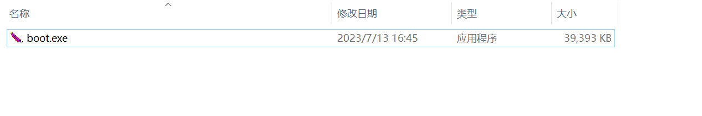
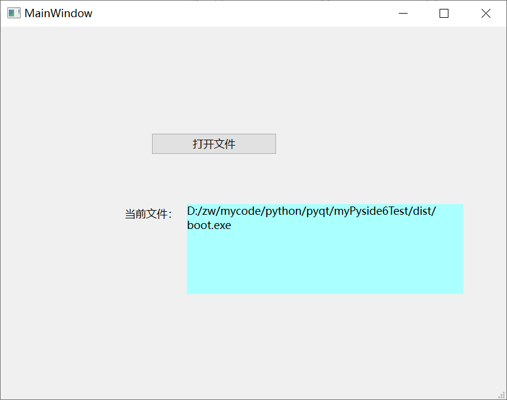

# myPyside6Test
Pyside6 pc 跨平台测试，在win10和centos8 桌面上都打包和测试过
# 开发环境
win10专业版+PyCharm 2022.1.2+python3.11.3
# python插件
PySide6
安装文档
https://doc.qt.io/qtforpython-6/quickstart.html
# 与pycharm开发配置
参考：https://mp.weixin.qq.com/s/DUaDynaf-3q4hbZQvuc3Bg  
注意: 外部工具需要用全局安装插件，不能使用虚拟目录，也就是说，如果使用虚拟目录，需要安装两次pyside6，否则设计器没有办法使用

# 打包命令
进入到项目目录然后执行  
pyinstaller -F --noconsole -i favicon.ico  .\boot.py

#效果图

